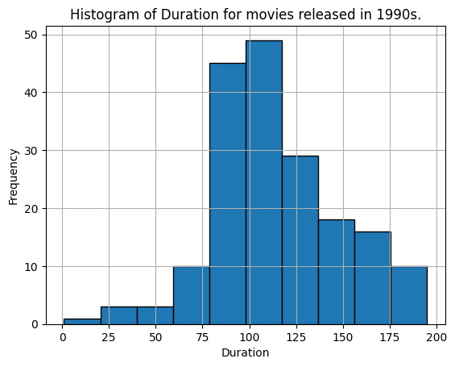

**Netflix**! What started in 1997 as a DVD rental service has since exploded into one of the largest entertainment and media companies.

Given the large number of movies and series available on the platform, it is a perfect opportunity to flex your exploratory data analysis skills and dive into the entertainment industry.

You work for a production company that specializes in nostalgic styles. You want to do some research on movies released in the 1990's. You'll delve into Netflix data and perform exploratory data analysis to better understand this awesome movie decade!

You have been supplied with the dataset `netflix_data.csv`, along with the following table detailing the column names and descriptions. Feel free to experiment further after submitting!

## The data
### **netflix_data.csv**
| Column | Description |
|--------|-------------|
| `show_id` | The ID of the show |
| `type` | Type of show |
| `title` | Title of the show |
| `director` | Director of the show |
| `cast` | Cast of the show |
| `country` | Country of origin |
| `date_added` | Date added to Netflix |
| `release_year` | Year of Netflix release |
| `duration` | Duration of the show in minutes |
| `description` | Description of the show |
| `genre` | Show genre |

```python
# Filter movies released in the 1990s.
netflix_90s_df = netflix_df[(netflix_df["release_year"] >= 1990) & (netflix_df["release_year"] <= 1999)]
netflix_90s_df
```

Based on our movies list, there are 184 movies that are released in the 1990s. 


```python
# Find the most frequent movie duration in 1990s.
plt.hist(netflix_90s_df["duration"], edgecolor = "black")
plt.title("Histogram of Duration for movies released in 1990s.")
plt.xlabel("Duration")
plt.ylabel("Frequency")
plt.grid(True)
plt.show()
```
    

    
Based on this histogram, we can see that as an approximate, the most frequent movie duration is 110 minutes.

```python
# Calculate the count of short action movies released in the 1990s.
short_movie_count = len(netflix_90s_df[(netflix_90s_df["duration"] < 90) & (netflix_90s_df["genre"].str.lower() == "action")])
short_movie_count
```
There are 7 movies that are short action movies.

